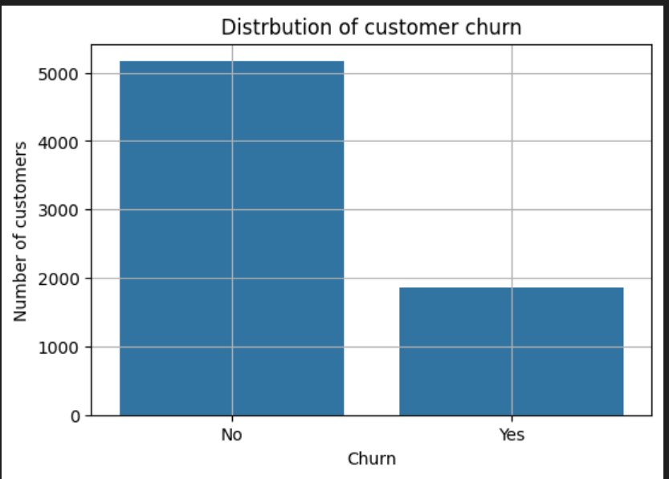
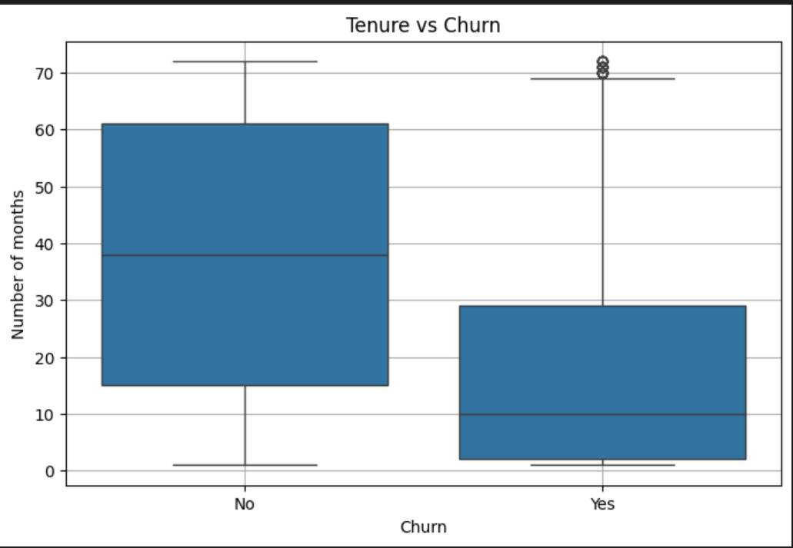
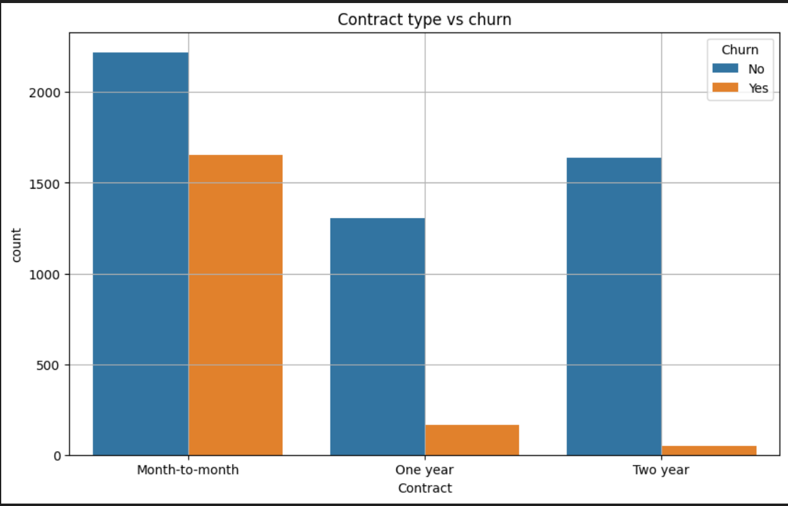

# 📊 Customer Churn Analysis

## 🎯 Project Overview

Customer churn is one of the most critical challenges for subscription-based and telecom businesses. Retaining existing customers is significantly more cost-effective than acquiring new ones.

This project aims to analyze customer behavior, identify churn patterns, and provide actionable business insights to reduce customer attrition.

## 💼 Business Problem

The company is experiencing customer attrition. The objective is to:

- Identify which customers are most likely to churn
- Understand the factors influencing churn
- Provide recommendations to improve customer retention

## 📂 Dataset Information

This project uses the **Telco Customer Churn** dataset available on Kaggle:  
🔗 https://www.kaggle.com/datasets/blastchar/telco-customer-churn

- **Total Records:** 7,043 customers  
- **Total Features:** 21 columns  
- **Target Variable:** `Churn` (Yes / No)  
- **Domain:** Telecommunications Customer Retention Analysis  

## 🛠 Tools & Technologies

- **Python** – Data analysis and implementation  
- **NumPy** – Numerical computations  
- **Pandas** – Data cleaning, manipulation, and analysis  
- **Matplotlib & Seaborn** – Data visualization and exploratory data analysis  
- **Jupyter Notebook** – Interactive analysis and reporting environment

## 🔎 Project Workflow
1. Business Understanding
2. Data Cleaning
3. Exploratory Data Analysis
4. Feature Engineering
5. Insights Extraction
6. Business Recommendations

## 📊 Key Exploratory Analysis

### 1️⃣ Churn Distribution
- 📉 **Overall Churn Rate:** 27%
The dataset shows that approximately 27% of customers have churned, indicating a significant retention challenge for the company.  
This highlights the importance of identifying high-risk customer segments.

---

### 2️⃣ Tenure vs Churn

- Customers with shorter tenure exhibit significantly higher churn rates.
- Long-tenure customers demonstrate greater stability and retention.

This suggests that the first few months of the customer lifecycle are critical for retention strategies. Early engagement and onboarding improvements may reduce churn.

---

### 3️⃣ Contract Type vs Churn

- 📌 **Month-to-Month Contract:** 42.7% churn rate  
- 📌 **One-Year Contract:** 11.3% churn rate  
- 📌 **Two-Year Contract:** 2.8% churn rate  

Customers on month-to-month contracts are substantially more likely to churn compared to those on long-term contracts.  
This indicates that contract commitment plays a major role in customer retention.

